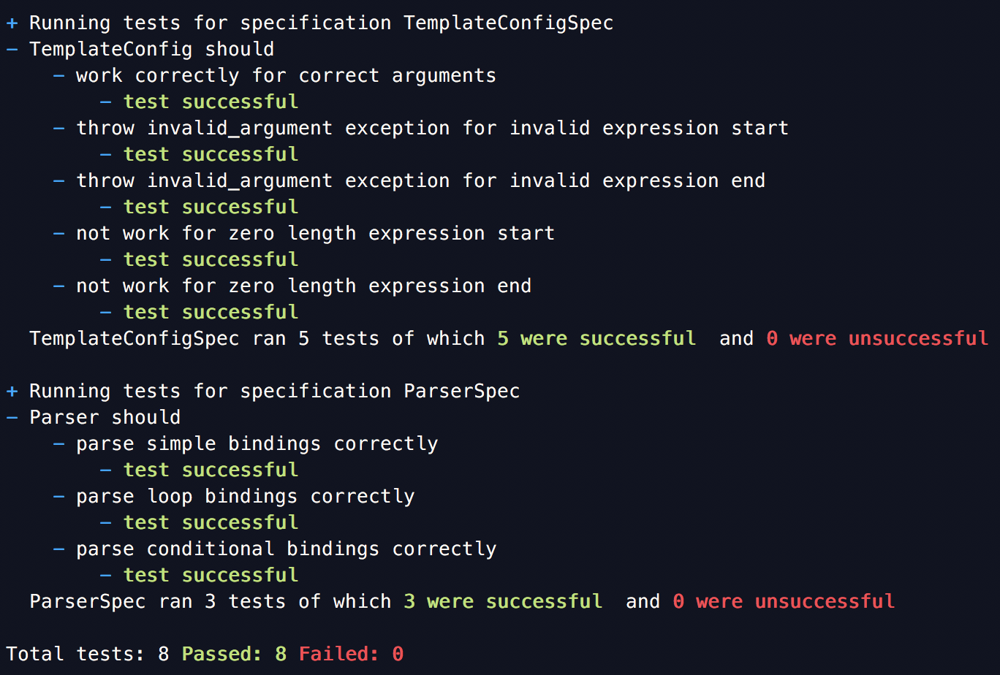

# Simple Templates
Simple templates is a templating library written entirely in C++.

#### Installation
Simple templates uses `cmake` as a build system. For cmake projects
it is better to have an [out-of-source](https://gitlab.kitware.com/cmake/community/wikis/FAQ#what-is-an-out-of-source-build) 
build tree.

The code uses C++ 14 as a standard and has no external dependencies.

```shell script
export CXX=g++-9
mkdir build
cd build
cmake --configure ..
# For building the library and the tests you can build all targets
../build_all
```

This should create an executable `engine_test`. Run it to check if the library compilation
was a success. The results from the test would look something like this.


Other than the executable cmake should also have created
a static library `libsimple_templates.a` which you can link to your own project.

#### User Documentation
###### Usage
Simple templates works with streams. A sample code for usage and its output
is given below.
```c++
#include <iostream>
#include <string>
#include <sstream>

#include "TemplateEngine.hpp"
#include "Template.hpp"
#include "Renderable.hpp"
#include "TemplateConfig.hpp"
using namespace std;
int main() {
    std::stringstream istream("Hello {{user}}! Welcome to Simple Templates!");
    std::stringstream outstream;
    TemplateConfig myConfig("{{", "}}");
    TemplateEngine myEngine;
    Template myTemplate = myEngine.compile("WelcomeTemplate", istream, myConfig);
    std::map<std::string, std::unique_ptr<Renderable>> myContext;
    myContext.insert({"user", std::make_unique<StringRenderable>("Suhaib")});
    myTemplate.bind(outstream, myContext);
    std::cout<<outstream.str()<<std::endl;
}
```

Lets we call this file `test.cpp`. You can compile this as follows:

```shell script
g++-9 --std=c++14 -I<path_to_simple_templates>/includes -c test.cpp  -o test.o
```

Then link it against the compiled library we produced above.

```shell script
g++-9 test.o -L <path_to_simple_templates>/build -lsimple_templates -o test.exe
```

And finally you can run it
```shell script
./test.exe
Hello Suhaib! Welcome to Simple Templates!
```

###### Template Configuration
Template start and end expressions are defined through the `TemplateConfig`.
The start and end expression strings must be non-zero length and can contain
the following characters `{[(<|$>)]}`.

###### Context
The context map is an `std::map`. The following type of
types are supported.
* `StringRenderable`: For simple strings.
* `IntRenderable`: For simple integers.
* `FloatRenderable`: For simple floating point numbers.
* `BoolRenderable`: For simple booleans.
* `ListRenderable<Renderable>`: For an array of any of the simple types or
 another list.
 
 Important: Contexts are not reusable. The data inside a context could have been moved
 after calling `Template::bind`.
 
###### Expressions
The template supports three types of expressions. Unless otherwise mentioned
`{{` and `}}` are used as the expression-start and expression-end symbol throughout
this documentation.
* Simple: Any variable within the `{{` and  `}}`. Variable names must
start with an alphabet and can  only contain alphabets, numbers and '_'.
* Conditional: Following is an example of a conditional expression.
```mustache
{{#if conditionalVar}}
Do something here
{{/if}}
```
The `conditionalVar` must be a valid variable name that maps to a 
`BoolRenderable` in the context when binding.
* Loops: Following is an example of a loop.
```mustache
{{#loop listVar loopVar}}
Do something here with {{loopVar}}
{{/loop}}
```
The `listVar` must be a valid variable name that maps to a
`ListRenderable` in the context when binding. Since the context is global,
the `loopVar` must not collide with any other variable in the context
including other loop variables.

You can also nest loops within loops or loops within conditions and so on.  